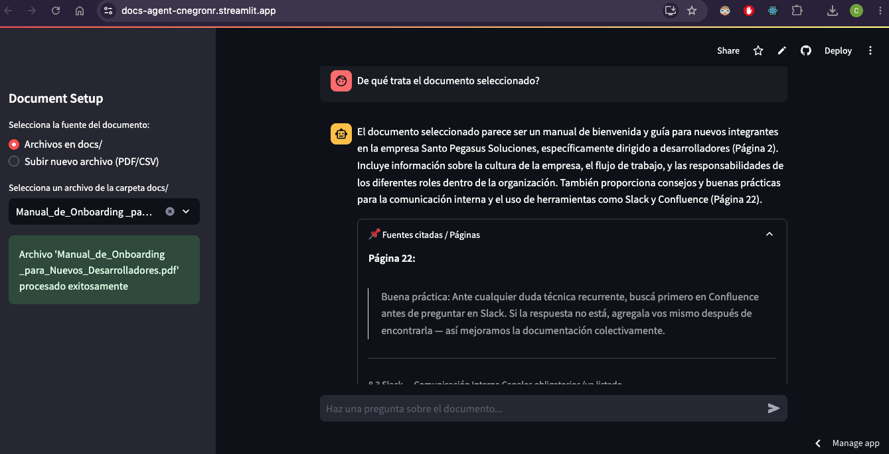
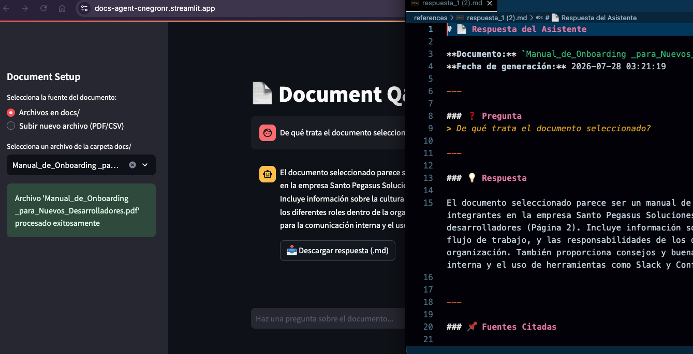
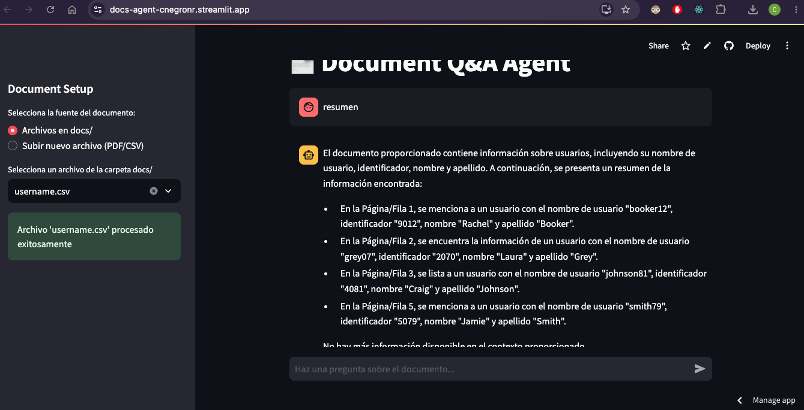
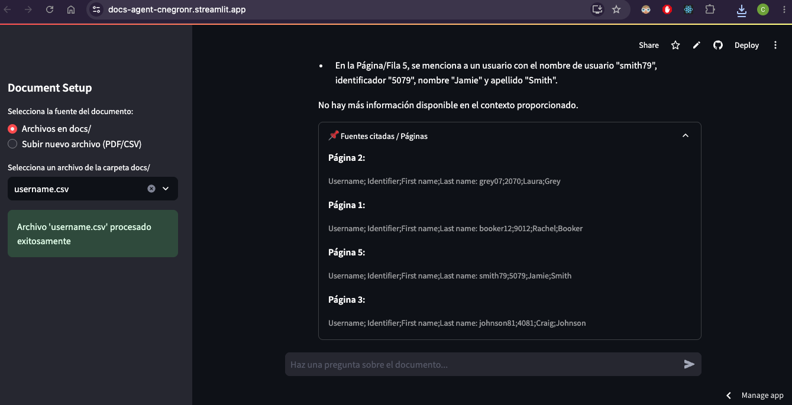

# Document Q&A Agent

An AI agent that answers questions about the content of a PDF/CSV file.

## Description

This project implements a retrieval-augmented generation (RAG) system that enables intelligent question-answering over PDF/CSV documents. The agent processes PDF/CSV files, creates semantic embeddings, and uses a language model to answer user queries based on the document content with cited page references.

## Tech Stack

- **Language Model**: 
  - Groq (`langchain-groq`) - High-speed inference for `llama-3.3-70b-versatile`

- **Embeddings & Vector Store**:
  - HuggingFace Embeddings (`langchain-huggingface`) - `all-MiniLM-L6-v2` model
  - FAISS (`faiss-cpu`) - Efficient vector similarity search

- **Framework**:
  - LangChain ecosystem:
    - `langchain` - Core framework
    - `langchain-core` - Base abstractions
    - `langchain-community` - Community integrations
    - `langchain-classic` - Deprecated chains (for compatibility with Alura course content)
    - `langchain-text-splitters` - Text chunking utilities

- **Document Processing**:
  - `pypdf` - PDF loading and parsing
  - `pandas` - CSV dataset parsing and row-level document conversion

## Setup

### Prerequisites
- Python 3.14+
- API Key for Groq (set as environment variable `GROQ_API_KEY`)
- API Key for HuggingFace (set as environment variable `HUGGINGFACEHUB_API_TOKEN`)

### Installation

1. **Clone or navigate to the project directory**:
   ```bash
   cd pdf-agent
   ```

2. **Create and activate a virtual environment**:
   ```bash
   python -m venv .venv
   source .venv/bin/activate  # macOS/Linux
   # or
   .venv\Scripts\activate  # Windows
   ```

3. **Install dependencies**:
   ```bash
   pip install -r requirements.txt
   ```

4. **Set up environment variables**:
   Create a `.env` file in the project root:
   ```env
   GROQ_API_KEY=your_groq_api_key_here
   HUGGINGFACEHUB_API_TOKEN=your_groq_api_key_here
   ```

### Running the Agent

#### Option 1: From Terminal
```bash
streamlit run app.py 
```

## Project Files

- `app.py` - Agent implementation UI focused
- `tools.py`- Agent tools implementation
- `requirements.txt` - Python package dependencies with pinned versions
- `README.md` - This file

## Features

✅ PDF and CSV document loading and processing using `pypdf` & `pandas`  
✅ Select existing files (PDF/CSV) from `docs/` folder or upload new files  
✅ Semantic text chunking (1000 chars with 150 char overlap)  
✅ Vector embeddings using HuggingFace (`all-MiniLM-L6-v2`)  
✅ FAISS-based similarity search  
✅ LLM-powered question answering with context awareness  
✅ Download each assistant response as a `.md` file  
 
## Environment Variables

- `GROQ_API_KEY` - API key for Groq LLM service (required)
- `HUGGINGFACEHUB_API_TOKEN` - API key for HUGGING FACE service (required)


## Notes

- The HuggingFace `all-MiniLM-L6-v2` model is lightweight and efficient for semantic search
- Groq provides fast inference at scale for the Llama 3.3 70B model
- FAISS is optimized for CPU-based similarity search
- Document chunks overlap by 150 characters to maintain context continuity

## Use

- Simply navigate to the left panel and choose/upload a document, and start asking questions
- You can download an answer in md file format just pressing the download button below
- You can check the page/row numbers used to get the answer


---


---

---

---


---

## URL

[Docs Alura Agent](https://docs-agent-cnegronr.streamlit.app/)

## Author

Carlos Negrón

[LinkedIn](https://www.linkedin.com/in/carlosnegron/)
